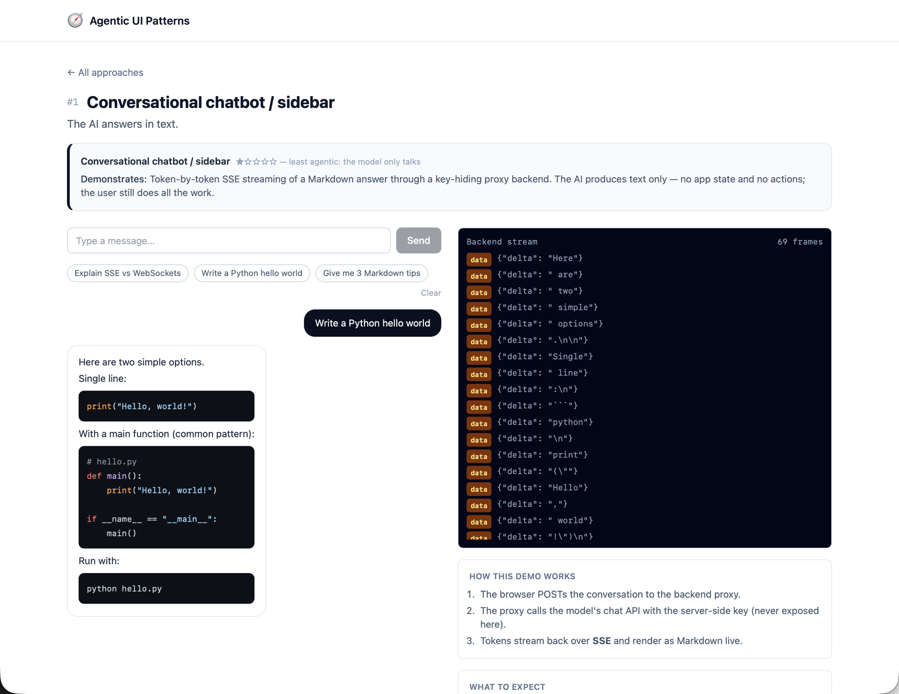
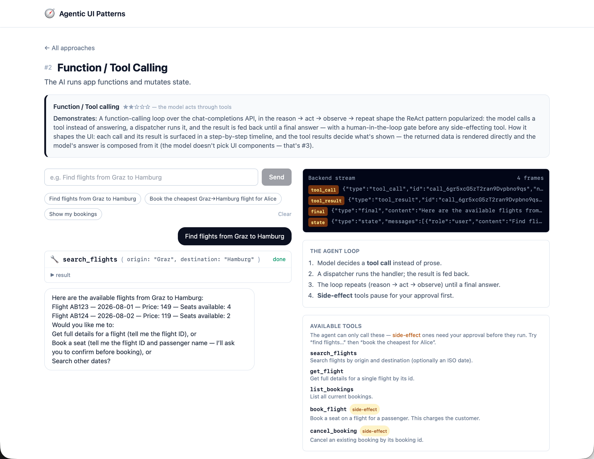
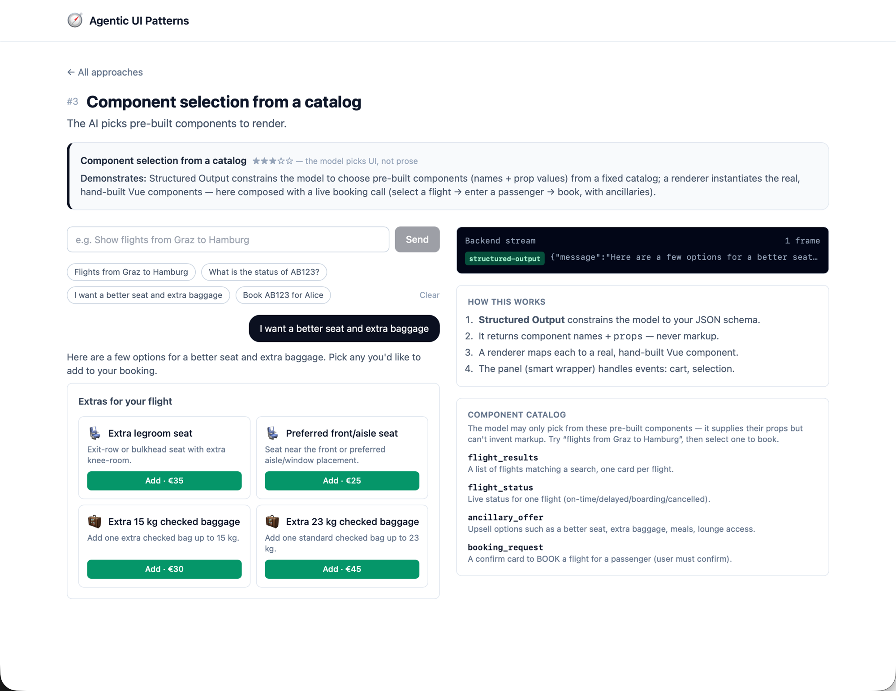
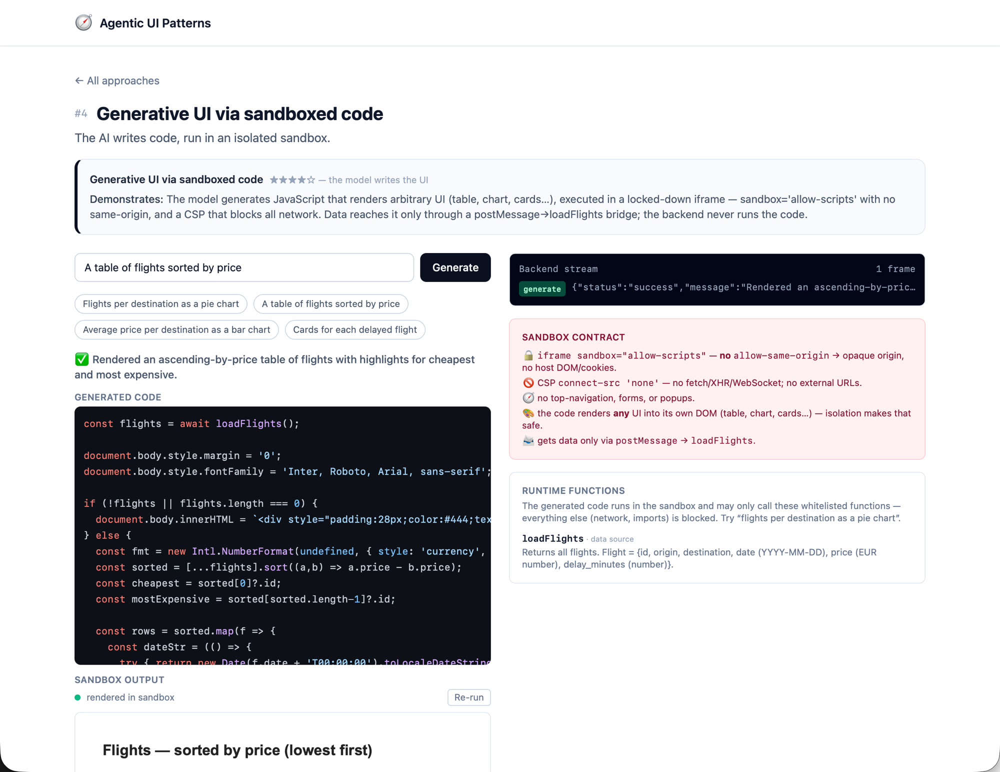
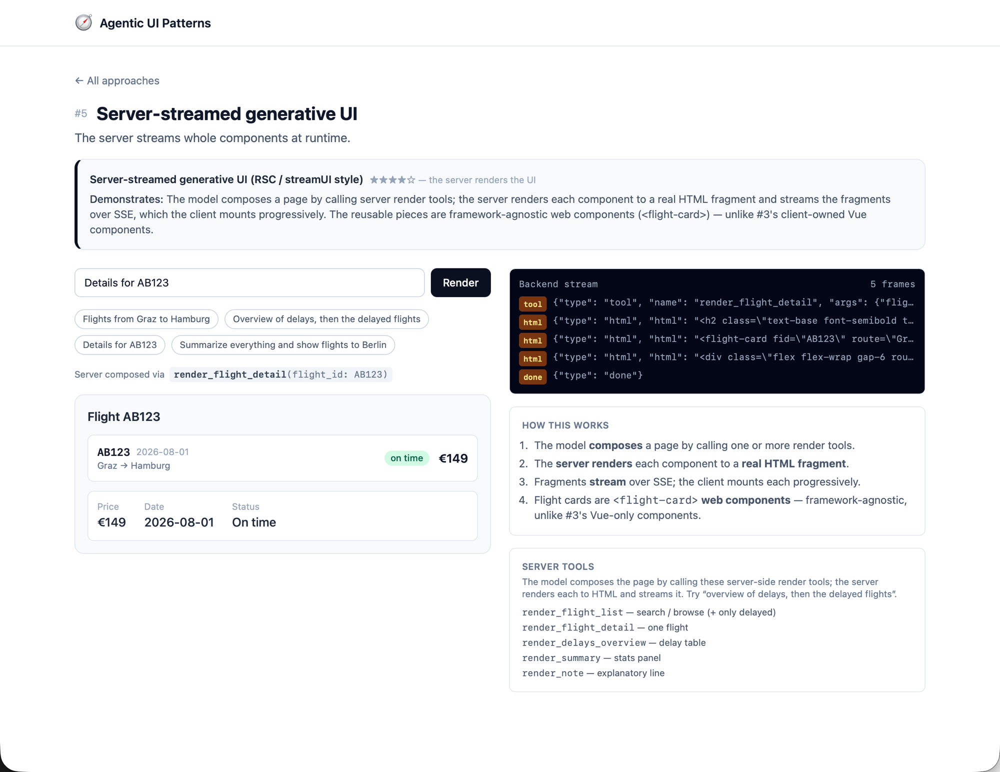
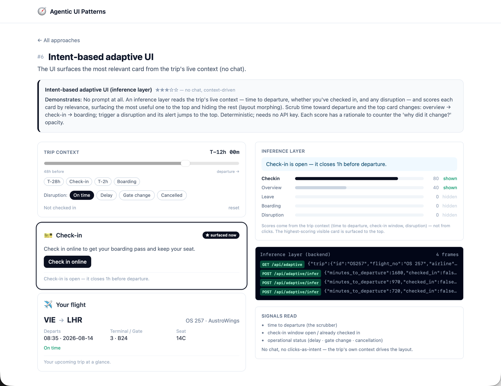
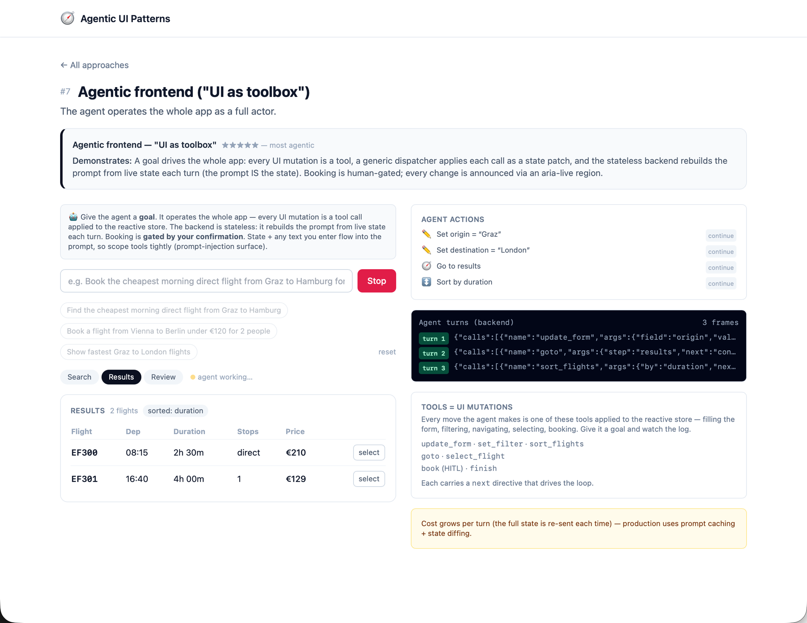
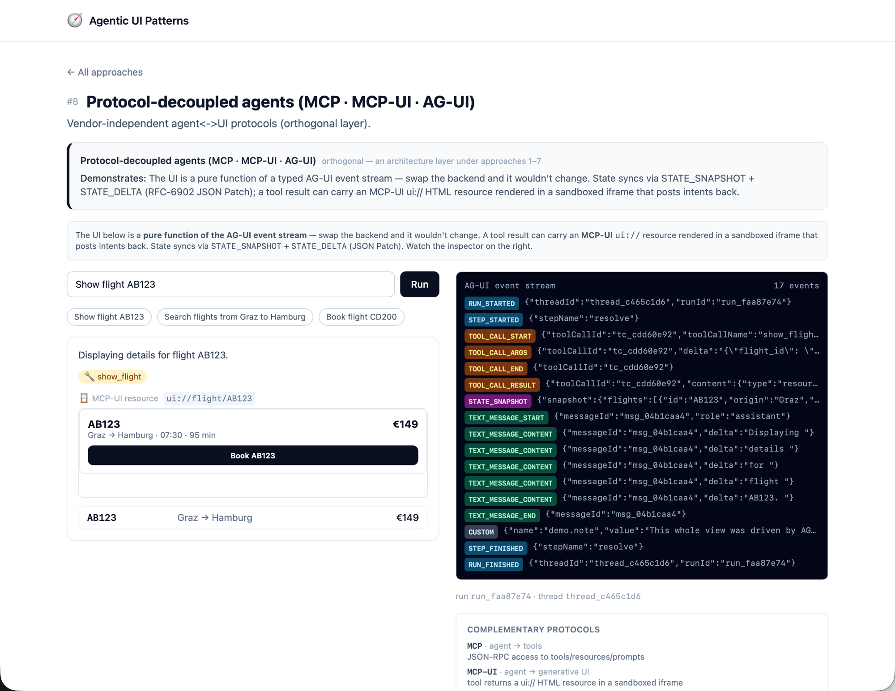

# Agentic UI Patterns

A practical map of the ways an AI/LLM can drive, generate, or adapt a user interface — from a chatbot that only *talks* to a frontend the agent fully *operates* — **plus a runnable reference implementation of all 8 patterns** (FastAPI + Nuxt, Docker, CI).

Use it to pick the right approach for a feature and understand what each one costs to build and run.

Every approach is a variation on one loop:

```
user input ──▶ [ AI reasoning ] ──▶ output that changes the UI ──▶ result fed back
```

What differs between approaches is **three things**:

- **Input** — what the AI receives (typed text, voice, or implicit telemetry) and how much app context comes with it.
- **Output** — what the AI produces (text, a structured action, a component choice, generated code, or a layout decision).
- **Authority** — how much the AI is allowed to *do* vs. merely *suggest*.

The list runs from least to most agentic: the higher entries let the AI talk; the lower ones let it act on and generate the interface itself.

## Contents

- [Overview](#overview)
- [The approaches in detail](#the-approaches-in-detail) — with a screenshot of each running demo
- [Engineering comparison](#engineering-comparison)
- [**Running the demo**](#running-the-demo) — quickstart (local · Docker)

## Overview

| # | Approach | Input | Output | Agentic level |
|---|----------|-------|--------|:---:|
| 1 | **Conversational chatbot / sidebar** | User text | Streamed text (Markdown) | ★☆☆☆☆ |
| 2 | **Function / Tool Calling** | User text + tool schemas | Structured function call(s) → executed | ★★☆☆☆ |
| 3 | **Component selection from a catalog** | User text + component catalog | JSON choosing component(s) + their data | ★★★☆☆ |
| 4 | **Generative UI via sandboxed code** | User request + runtime function list | Generated code (run in a sandbox) | ★★★★☆ |
| 5 | **Server-streamed generative UI** | User prompt + component-returning tools | A component streamed at runtime | ★★★★☆ |
| 6 | **Intent-based adaptive UI** | Implicit telemetry (no chat) | Re-ranked / re-rendered layout | ★★★☆☆ |
| 7 | **Agentic frontend ("UI as toolbox")** | User goal + live app state | Stream of state-mutating tool calls | ★★★★★ |
| 8 | **Protocol-decoupled agent (AG-UI)** | Messages + tool/component descriptions | Typed protocol message stream | orthogonal |

**They stack, they aren't exclusive.** Approaches build on each other: #3–#5 and #7 all rely on the tool/function-calling mechanism of #2, a chat surface (#1) can render selected components (#3), and #8 is a transport layer that can carry any of the others. Read the list as capabilities to combine, not options to choose between.

---

## The approaches in detail

Each card follows the same shape: **Input → Output → How it works → What you need → Best for → Trade-offs**, followed by a screenshot of that pattern's demo in this repo (left: the UI · right: the raw backend stream).

### 1. Conversational chatbot / sidebar

<!-- screenshot -->
<p align="center"><a href="docs/screenshots/conversational-chatbot.png"></a></p>

- **Input:** User's natural-language message plus conversation history (optionally augmented with retrieved documents / RAG context).
- **Output:** A streamed natural-language answer, usually rendered as Markdown with code highlighting.
- **How it works:** The prompt is sent to the LLM; tokens stream back over SSE (Server-Sent Events) and are appended to the last message as they arrive. The UI renders Markdown incrementally and auto-scrolls while the user is at the bottom.
- **What you need:** An LLM API, a thin proxy backend to hide the API key, a streaming transport (SSE), and a Markdown/code renderer. No access to app state or actions.
- **Best for:** Q&A, help, search, drafting, explanation.
- **Trade-offs:** ➕ Simplest to build; familiar UX; streaming hides latency; low risk (the model only talks). ➖ Doesn't change how the app is used — the user still does all the work; no live data or actions.

### 2. Function / Tool Calling

<!-- screenshot -->
<p align="center"><a href="docs/screenshots/tool-calling.png"></a></p>

- **Input:** User intent in natural language plus a set of **tool definitions** (name, description, and a JSON-Schema for arguments).
- **Output:** A structured **tool call** — the function name and validated arguments — which your code executes; the result is fed back to the model, which then answers.
- **How it works:** The model decides a tool is needed and emits a call instead of prose. A dispatcher runs the matching handler, appends the result to the context window, and the loop repeats (the ReAct pattern: reason → act → observe → repeat) until the model produces a final answer. Tools can run **server-side** (privileged, DB/API) or **frontend** (in the browser — read component state, call browser APIs, mutate the UI directly).
- **What you need:** Tool schemas (OpenAI function calling / Anthropic tool-use / AI SDK `tool()`), a dispatcher (name → handler map), an **agent-loop runner** that re-invokes the model with each tool result until it returns a final answer, a backend for privileged actions and key hiding, and access to the data/state the tools touch. Optionally an orchestration framework (LangChain/LangGraph) and persistent memory. A **permission layer** before side effects run — never blindly execute a model-chosen action. This is the **foundational primitive nearly every richer approach builds on.**
- **Best for:** Fetching real-time data, calling APIs, performing discrete actions ("book this", "search flights").
- **Trade-offs:** ➕ Connects the LLM to real data and actions; supports multi-step reasoning; framework-agnostic. ➖ Non-deterministic; the right tool granularity is hard (too fine = many chained calls, too coarse = inflexible); cost and latency per round-trip.

### 3. Component selection from a catalog

<!-- screenshot -->
<p align="center"><a href="docs/screenshots/component-selection.png"></a></p>

- **Input:** User intent plus a **catalog of pre-built UI components**, each described with a name, a purpose, and an input schema.
- **Output:** A **Structured Output** JSON document naming one or more components and supplying their prop values (e.g. under a `$props` key).
- **How it works:** Structured Output constrains the model to emit JSON that matches your schema. A renderer reads that JSON and instantiates the real, hand-built components with the model-supplied data. A "smart wrapper" around each "dumb" presentational component handles events, state, and navigation.
- **What you need:** A component library, schema descriptions per component, a model that supports Structured Output (`generateObject`/`streamObject`, CopilotKit `useCopilotAction` + `render`), and a dynamic renderer. Weaker models need few-shot examples to infer inputs correctly; some models can't combine Structured Output with Tool Calling (needs an emulation workaround).
- **Best for:** Rich, interactive answers — cards, forms, charts, product tiles — instead of plain prose.
- **Trade-offs:** ➕ Interactive and on-brand; components stay hand-built and testable in isolation. ➖ Limited to a fixed catalog; input inference is unreliable on cheap models.

### 4. Generative UI via sandboxed code

<!-- screenshot -->
<p align="center"><a href="docs/screenshots/sandboxed-code.png"></a></p>

- **Input:** A user request plus a list of **runtime functions** the generated code may call (each a data source or a sink, with described argument/return schemas).
- **Output:** **Generated code** (typically JavaScript) plus a status and a user-facing message, returned as a structured object.
- **How it works:** Because models compute unreliably but *describe* computation well, the model emits code (or full React/HTML/JS) rather than doing the math. It runs in an **isolated runtime with no access to the app** — an iframe sandbox, WebContainer, or cloud VM (E2B, ~400–600ms cold start) — calling only whitelisted functions (e.g. `loadFlights`, `generateChart`). Products: **v0** (React + Tailwind + shadcn/ui), **Claude Artifacts / MCP Apps** (server HTML in a sandboxed iframe, `postMessage` back to host).
- **What you need:** A sandboxed runtime, a whitelist of callable functions with schemas plus a **host↔sandbox `postMessage` bridge** so sandboxed code can invoke them, a build/transpile step (JSX/TS → runnable), and a **strict security contract** — CSP, `allow-scripts` *without* `allow-same-origin`, no top-navigation; treat all generated code as an active attack vector. Guardrail prompting ("never use external resources", "always return via the runtime").
- **Best for:** No/low-code builders, rapid prototyping, and open-ended charts no fixed component covers.
- **Trade-offs:** ➕ Maximum flexibility — genuinely novel UI for unanticipated problems. ➖ Highest latency (generate + build/execute) and largest security surface; non-deterministic; hardest to test.

### 5. Server-streamed generative UI (RSC / v0 style)

<!-- screenshot -->
<p align="center"><a href="docs/screenshots/server-streamed-ui.png"></a></p>

- **Input:** A user prompt plus a server-side tool set whose tools return UI components.
- **Output:** A **rendered component streamed at runtime** — serialized on the server and progressively rendered on the client.
- **How it works:** On the server, the model picks a tool that returns a component (often built on a design system); a server-side streaming helper (React Server Components) serializes it and streams it to the client just like text. The component is typically ephemeral — discarded on navigation.
- **What you need:** A server-rendering framework (Next.js / RSC or equivalent), server infrastructure, and a component set the tools can return.
- **Best for:** Historically, Next.js-native teams wanting deep RSC integration.
- **⚠️ Status:** RSC-based generative UI has been **officially paused upstream**, with new projects steered toward client-rendered tool-calling + structured output (#2/#3). Treat RSC as legacy, not a default.
- **Trade-offs:** ➕ Pre-written components streamed with no code-gen/sandbox step; strong type safety; good partial-render latency. ➖ Tightly coupled to Next.js/RSC (framework lock-in); complex mental model; now deprioritized upstream.

### 6. Intent-based adaptive UI (inference layer)

<!-- screenshot -->
<p align="center"><a href="docs/screenshots/intent-adaptive.png"></a></p>

- **Input:** **Implicit user telemetry** — clicks, dwell time, mouse movement, usage history — not a chat message.
- **Output:** A **re-rendered or re-ranked interface**: which components appear, in what order, with which emphasis.
- **How it works:** An inference layer sits between interaction and render, scoring signals into an intent probability. "Intent hooks" then decide what to render (e.g. surface a data grid vs. an assistant; reorder listings by predicted booking probability; hide widgets irrelevant to the time of day or role).
- **What you need:** A telemetry pipeline, an inference model or scoring service, a state store for derived preferences, and component/layout variants to switch between. No conversational surface at all.
- **Best for:** Consumer apps optimizing engagement/conversion at scale (feeds, marketplaces); inappropriate for high-stakes, compliance-sensitive UIs where predictability beats optimization.
- **Trade-offs:** ➕ Zero extra user effort; anticipatory (prefetching, zero-UI, layout morphing); a controlled study reports gains in time-on-platform, CTR, satisfaction. ➖ Opaque ("why did it move?"); hard to make reversible/testable; **PII / GDPR-class consent and data-privacy exposure**. **Least production-mature of the eight** — reviews still cite model complexity and data quality as unsolved.

### 7. Agentic frontend ("UI as toolbox")

<!-- screenshot -->
<p align="center"><a href="docs/screenshots/agentic-frontend.png"></a></p>

- **Input:** A user **goal** (typed or spoken) plus the **current app state**, injected into the prompt on every turn.
- **Output:** A **stream of tool calls** — each a state patch (e.g. fill a field, filter a table, navigate) carrying a `nextStep` directive — applied to the reactive store.
- **How it works:** The key insight is that *an LLM function call and a frontend state mutation are the same thing*, so every UI mutation is exposed as a callable tool. A generic dispatcher applies each call as a patch and re-renders. The system prompt is rebuilt from live state each request ("the prompt *is* the state"), acting as a state machine — no separate client-side conversation memory. Deterministic flow stays in the frontend; only interpretive decisions go to the model.
- **What you need:** A flat tool schema covering UI actions, a generic dispatcher, a reactive state layer (signals / Redux / Zustand), a prompt builder that serializes state, **prompt caching + state diffing** to control cost, **human-in-the-loop gates** (`useHumanInTheLoop`, LangGraph interrupt/breakpoint) before destructive actions, visible feedback per action, and **`aria-live` regions** so screen readers announce agent-driven changes. Frameworks: CopilotKit's "Agentic Frontend Stack" over AG-UI.
- **Best for:** Collaborative "co-pilot" workspaces (travel planning, portfolio allocation) where the agent acts inside a stateful app; in vendor-reported production use at Docusign, Cisco, S&P Global, Deutsche Telekom, Function Health (adoption only — no published performance data).
- **Trade-offs:** ➕ Most capable; unifies data and navigation logic; transport- and voice-agnostic. ➖ Costliest (full prompt rebuilt each turn); too slow for keystroke-level interactions; unsafe for regulated/high-stakes flows without explicit human confirmation; **prompt-injection exposure** — untrusted content and live app state enter the prompt every turn; largest blast radius, so scope tools tightly; accessibility must be built in deliberately.

### 8. Protocol-decoupled agents (MCP · MCP-UI · AG-UI)

<!-- screenshot -->
<p align="center"><a href="docs/screenshots/protocol-decoupled.png"></a></p>

Not a rung on the ladder but an **architectural layer under approaches 1–7** — open standards that solve the "M×N" glue problem (every agent framework needing custom wiring for every frontend). They are **complementary, not competing**:

| Protocol | Connects | Role |
|---|---|---|
| **MCP** (Model Context Protocol) | agent → **tools** | JSON-RPC access to external tools/resources/prompts (Anthropic, Nov 2024) |
| **MCP Apps / MCP-UI** | agent → **generative UI** | a tool returns a `ui://` HTML resource, rendered in a sandboxed iframe, `postMessage` back to the host |
| **AG-UI** | agent → **user interface** | event stream syncing agent activity to the UI |
| *(A2A — agent ↔ agent)* | agent → **other agents** | different layer; not a UI spec (listed only to disambiguate from A2UI below) |

- **Input / Output:** Messages + tool/component descriptions in → a **stream of typed protocol events** out. AG-UI defines **16 event types** across five groups (lifecycle, text message, tool call, state, special), incl. **`STATE_DELTA` (a JSON Patch / RFC 6902 array) and `STATE_SNAPSHOT` (full state)** for efficient bidirectional sync. Everything is a "Run" (all messages answering one question) grouped into threads; content splits into deltas for streaming.
- **What you need:** The protocol SDK (TS/Python), a framework adapter, a transport (SSE/WebSockets/binary), and usually a thin framework wrapper. MCP-UI ships `@mcp-ui/client` + `@mcp-ui/server` for "write once, render everywhere."
- **Best for:** Multi-framework/multi-vendor orgs avoiding lock-in; overkill for a single app that will never swap its agent backend.
- **Trade-offs:** ➕ True frontend/backend/vendor decoupling; streaming built in; inspectable in DevTools; broad adopter momentum (Google, AWS, Microsoft, Oracle, LangChain, Mastra). ➖ Young specs (MCP Apps launched Jan 2026) with maturing tooling/security practices; short-term fragmentation across competing UI specs.

#### Competing generative-UI payload specs

A key distinction the layers above blur: **AG-UI is the agent↔UI *event/transport contract*, but the actual *UI payload* it carries is not yet standardized** — three specs compete for that slot, and AG-UI natively supports all three. They compete with **each other**, not with AG-UI or MCP. Two are **declarative component trees** (the model names components + props; the client renders them with its *own* trusted widgets — safe, no code execution), and one is a **sandboxed HTML document** (the server returns markup rendered in an isolated iframe — maximally flexible, heavier isolation). This is the same **#3-vs-#4 tension** this list already draws, standardized:

| Spec | Maintainer | Payload / wire format | Rendering model | Analog here |
|---|---|---|---|:---:|
| **A2UI** | **Google** (open project, `github.com/google/A2UI`) | JSONL stream of component/data-binding messages | Declarative tree → client's **trusted native widgets** (Card, Button, …); no code runs | #3 / #5 |
| **Open-JSON-UI** | **OpenAI** (open standardization of its internal schema) | Typed JSON component definitions | Declarative tree → client's trusted components; type-safe, OpenAI-model-friendly | #3 / #5 |
| **MCP-UI → MCP Apps** | Community: **Ido Salomon & Liad Yosef**; standardized as MCP Apps (SEP-1865) by **Anthropic + OpenAI** with them, Jan 2026 | A tool returns a `ui://` **HTML resource** | Rendered in a **sandboxed iframe**, `postMessage` back to host; "security by default" (CSP, no top-nav) | #4 |

> **Attribution note:** MCP-UI is *not* a Microsoft/Shopify project — those are adopters/hosts. It was created by Ido Salomon & Liad Yosef (community), then its patterns were folded into **MCP Apps**, the first official MCP extension, co-authored by MCP Core Maintainers at **Anthropic and OpenAI** together with the mcp-ui creators.
>
> The one axis that separates them: **declarative component tree** (A2UI · Open-JSON-UI — render into the host's design system, no code) **vs. sandboxed HTML document** (MCP-UI/MCP Apps — arbitrary markup, isolated). Sources: [A2UI](https://developers.googleblog.com/introducing-a2ui-an-open-project-for-agent-driven-interfaces/) · [Open-JSON-UI](https://docs.copilotkit.ai/learn/generative-ui/specs/open-json-ui) · [AG-UI GenUI specs](https://docs.ag-ui.com/concepts/generative-ui-specs) · [MCP Apps](https://blog.modelcontextprotocol.io/posts/2026-01-26-mcp-apps/).

---

## Engineering comparison

Qualitative ratings to weigh the operational cost of each approach. **Lower is cheaper/safer/easier** except where noted.

| # | Approach | Maturity | Build effort | Runtime cost | Latency | Determinism | Testability | Security exposure | Lock-in risk |
|---|----------|:---:|:---:|:---:|:---:|:---:|:---:|:---:|:---:|
| 1 | Conversational chatbot | Proven | Low | Low | Low | Med | High | Low | Low |
| 2 | Function / Tool Calling | Proven | Med | Med | Med | Low | Med | Med | Low |
| 3 | Component selection | Established | Med | Med | Med | Med | High | Low | Med |
| 4 | Sandboxed generated code | Emerging | High | Med | Med | Low | Low | **High** | Med |
| 5 | Server-streamed gen UI | **Paused** | High | High | Med | Low | Med | Med | **High** |
| 6 | Intent-based adaptive UI | Least mature | High | Med | Low | Low | Low | Med | Med |
| 7 | Agentic frontend | Emerging | High | **High** | High | Low | Med | Med–High | Med |
| 8 | Protocol-decoupled (AG-UI) | Emerging | Med | — | — | — | High | Low | **Low** |

---

# Running the demo

The model-backed approaches (all but #6) need a model key — without one they return `503` with a clear
message.

## Local Execution

```bash
# from the repo root
make setup                    # installs backend (uv) + frontend (pnpm)

make dev-backend              # terminal 1 → http://localhost:8000/docs
make dev-frontend             # terminal 2 → http://localhost:3000
```

Or per app, standalone:

```bash
cd backend  && uv sync && uv run agentic-ui-demo             # backend only
cd frontend && corepack enable && pnpm install && pnpm dev   # frontend only
```

The backend is **chat-API-agnostic** — it speaks the OpenAI chat-completions API to whatever endpoint
you point it at. Three variables, all `OPENAI_*`:

| Variable | Meaning |
|---|---|
| `OPENAI_API_KEY` | the API key |
| `OPENAI_MODEL` | the model (or deployment) name — default `gpt-4o-mini` |
| `OPENAI_BASE_URL` | the endpoint (optional; omit for OpenAI's default host) |

Point `OPENAI_BASE_URL` at anything that speaks the OpenAI chat API — OpenAI, **Azure OpenAI's
OpenAI-compatible v1 endpoint**, or a local server (Ollama, vLLM, LM Studio). The key stays
server-side; the frontend never sees it.

## Self-Contained Container Image

The root `Dockerfile` builds **one image** with the FastAPI backend + Nuxt frontend on a **single port
(8080)** — the Nuxt server serves the UI and proxies `/api` to the co-located backend
(`docker/start.sh` runs both; if either exits, the container stops so your orchestrator restarts it).
Small (no model baked in), talks to whatever OpenAI-compatible endpoint you configure at run time.

```bash
docker build -t agentic-ui-patterns .
docker run --rm -p 8080:8080 \
  -e OPENAI_API_KEY=sk-... \
  -e OPENAI_MODEL=gpt-4o-mini \
  agentic-ui-patterns
# → http://localhost:8080   (API at /api, docs at /api/docs)
# add -e OPENAI_BASE_URL=<endpoint> to target Azure's v1 endpoint, a local server, etc.
```

## Common tasks

```bash
make help            # list all targets
make check           # lint + test (what CI runs)
make test            # backend tests with coverage
```

See [`CONTRIBUTING.md`](./CONTRIBUTING.md) for the PR checklist.
